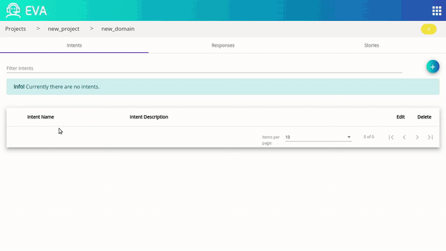
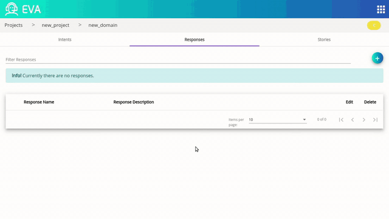
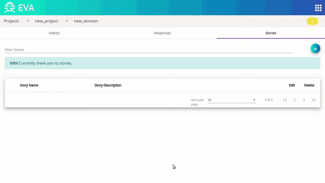

  

  
<h2>Enterprise Virtual Assistant (EVA)</h2>

# Table of Contents

* [About the Project](#about-the-project)
  * [Built With](#built-with)
* [Getting Started](#getting-started)
  * [Prerequisites](#prerequisites)
  * [Installation](#installation)
* [Documentation](#Documentation)
 
# About The Project

An Easy to use application to build train and deploy chat bots. This project intends to be a one stop shop for all production grade chat bot needs  

A snippet of how this application works ! 

 

## Built With

We used below projects as chat bot framework.

* [Rasa Open Source](https://github.com/RasaHQ/rasa) Version 1.10.11

The Application stack is built with Python as backend and Angular as front end. 

# Getting Stated 

We use [Docker hub](https://hub.docker.com/u/navigateconsulting) to publish docker container images.

## Prerequisites

   - Docker version 18.09 onwards. (not tested on previous versions)
   - Docker Compose version 1.24 onwards (not tested on previous versions)
   - Linux Distributions (Windows not supported as of now, tested on ubuntu)

## Installation 

If the project is to be deployed for production, please follow instructions for production deployment in below section

### Quick Installation

Download the docker-compose.yml file with below command

    wget https://raw.githubusercontent.com/navigateconsulting/virtual-assistant/master/docker-compose.yml
    
And start the application with a simple docker compose up command.

    docker-compose up -d

This will start the application user interface on port 8080. 

### Production Mode

For production deployment, all the user interface containers are recommended to be on TLS. Refer docker-compose.tls_example.yml file 
for how to configure and secure the deployment. Example contains a Letscert container which handles certificates and reissue on expiry.

Ensure below environment variables are set for containers which are to be secured. 

      - VIRTUAL_HOST=subdomain.domain.com
      - VIRTUAL_PORT=port_no
      - LETSENCRYPT_HOST=subdomain.domain.com
      - LETSENCRYPT_EMAIL=user@domain.com
 
For example , to secure the Ui-Trainer application , modify the docker compose file and add above mentioned environment 
variables as shown below

      va_api_gateway:
        init: true
        build: './va_api_gateway'
        environment:
          - PORT_APP=3000
          - WORKERS=1
          - THREADS=50
          - REDIS_URL=redis
          - REDIS_PORT=6379
          - MONGODB_HOST=mongodb
          - MONGODB_PORT=27017
          - RASA_SERVER=http://rasa:5005/model
          - VIRTUAL_HOST=subdomain.domain.com
          - VIRTUAL_PORT=port_no
          - LETSENCRYPT_HOST=subdomain.domain.com
          - LETSENCRYPT_EMAIL=user@domain.com
        ports:
          - "3000:3000"
        volumes:
          - rasa_projects:/rasa_projects
        depends_on:
          - redis

After modifying the docker compose file. First start the tls containers by running below command 

    docker-compose -f docker-compose.tls_example.yml up -d 
    
and once the containers are up, start the application stack. 

    docker-compose up -d

### For Development 

If you intent to extend the stack and make changes to the code base , follow below instructions to clone the repo and build containers from source

    git clone https://github.com/navigateconsulting/virtual-assistant
    cd virtual-assistant
    docker-compose -f docker-compose.build_from_source.yml build
    docker-compose -f docker-compose.build_from_source.yml up  

**Note:  docker-compose.yml file uses docker hub to pull docker containers and does not build from source.

# Documentation

Below are some short examples on how to use this application , detailed documentation on usage can be found [here](https://navigateconsulting.github.io/eva/docs/usage/) 

1. Creating an Intent 

2. Creating a Response 

3. Creating a Story

4. Try your Project 

# Roadmap

See the open issues for a list of proposed features (and known issues).

# Contributing 

Any contributions are Welcome ! To contribute, 

1. Fork the Project
2. Create your Feature Branch (git checkout -b feature/AmazingFeature)
3. Commit your Changes (git commit -m 'Add some AmazingFeature')
4. Push to the Branch (git push origin feature/AmazingFeature)
5. Open a Pull Request

# License

[Apache 2.0](LICENSE)
